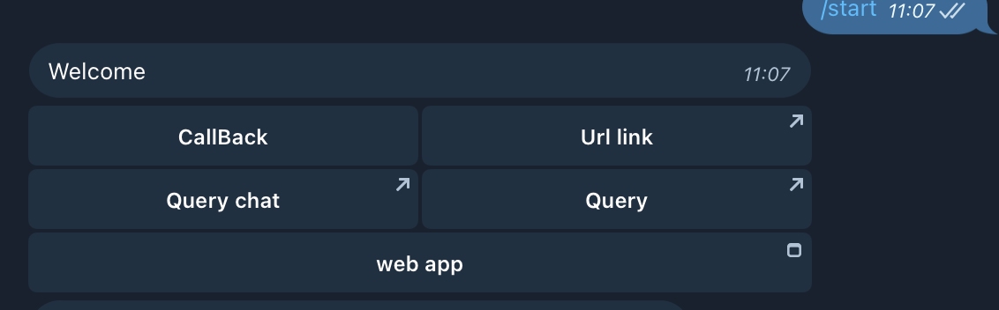
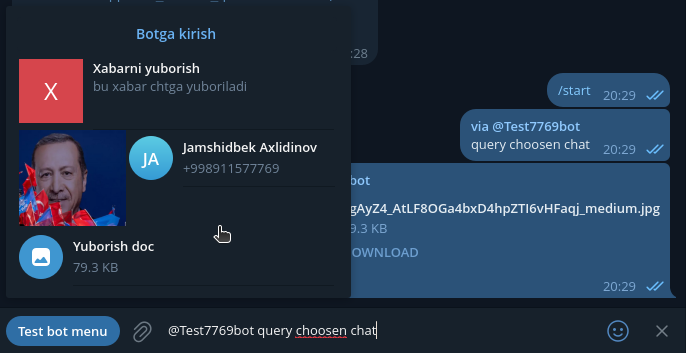

<h2>Telegram bot uchun qulay repositoriya</h2>

[](https://packagist.org/packages/ustadev/telegram)
[](https://wakatime.com/badge/user/d3110f77-d926-4238-8cdc-a8991b6685c0/project/018d46fc-a6e0-4576-b671-f3291d83cb6a)
[](https://packagist.org/packages/ustadev/telegram)

https://youtu.be/WAvfrmFMCzI?feature=shared

**O'rnatish**

        
    composer require ustadev/telegram

Ishlatish uchun qo'llanma

```php
<?php
    $bot = new BotApi("$token");
    $update = new Update($bot->getWebhookUpdate());

     if ($update->isMessage()) {
        $message = $update->getMessage();
        $text = $message->isText() ? $message->getText() : '';
        $user = $message->getUser();
        $user_id = $user->getId();
    
        if ($text == '/start') {
            $bot->sendMessage($user_id, "Welcome");
        }
    
        if ($text == '/video') {
            $bot->sendVideo($user_id, "vide url");
        }
    
        if ($text == '/doc') {
           $bot->sendDocument($user_id, "doc url");
        }
    
        if ($text == '/photo') {
            $bot->sendPhoto($user_id, "photo url");
        }
    
        if ($update->getMessage()->isAudio()) {
            print_r($update->getMessage()->getAudio());
        }
    
    }
    
?>

```

**Buttonlar(tugmalar) qo'yish uchun**

```php
$keyboard = new Keyboard();
$keyboard->addCallBack('CallBack','callBackData');
$keyboard->addUrl('Url link','https://t.me/jamshidbekakhlidinov');
$keyboard->addRow();
$keyboard->addSwtichInlineQueryCurrentChat('Query chat','query choosen chat');
$keyboard->addSwtichInlineQuery('Query','query text');
$keyboard->addRow();
$keyboard->addWebApp('web app', 'https://ustadev.uz');
$keyboard->addRequestPoll('poll button');

if ($text == '/button') {
    $bot->sendMessage(
        $user_id, 
        "<b>Buttons</b>",
        [
            'reply_markup' => $keyboard->init(),
            'parse_mode' => 'html',
        ]
   );
}

```



**CallBack buttonlar bilan ishlash**

```php
$bot = new BotApi("$token");
$update = new Update($bot->getWebhookUpdate());

if ($update->isCallbackQuery()) {
    $callback = $update->getCallbackQuery();
    $user = $callback->getUser();
    $user_id = $user->getId();
    $data = $callback->getData();
    
    $keyboard = new Keyboard();
    $keyboard->addCallbackDataButton("Button title", "data_name");
    
    if ($data == 'data_name') {
        $bot->sendMessage(
            $user_id, 
            "<b>Your text</b>", 
            [
                'reply_markup' => $keyboard->init(),
                'parse_mode' => 'html',
            ]
        );
    }  
}
```

**Inline Query bilan ishlash**

Bu yerda turli xildagi respons lar yaratish va ularning attribute lari yozib qo'yilgan

https://core.telegram.org/bots/api#inlinequeryresult

```php
$bot = new BotApi("$token");
$update = new Update($bot->getWebhookUpdate());

if ($update->isInlineQuery()) {
    $inlineQuery = $update->getInlineQuery();
    $query = $inlineQuery->getQuery();
    $query_id = $inlineQuery->getId();

    $keyboard = new Keyboard();
    $keyboard->addCallbackDataButton("Your CallBack button", "data_name");

    $photoUrl = "https://storage.kun.uz/source/thumbnails/_medium/10/egAyZ4_AtLF8OGa4bxD4hpZTI6vHFaqj_medium.jpg";

    if($query == 'photo'){
         $response = new InlineQueryResult();
         $response->addPhoto(
            "$photoUrl",
            "Rasmni yuborish",
            [
                'description' => 'bu rasm chatga yuboriladi',
                'caption' => $query,
            ]
        );
         $bot->answerInlineQuery(
            $query_id,
            $response->init(),
        );
    }

    if($query == 'text'){
          $response = new InlineQueryResult();
          $response->addText(
            "Xabarni yuborish",
            "$query",
            [
                'description' => 'bu xabar chtga yuboriladi'
            ]
          );
         $bot->answerInlineQuery(
            $query_id,
            $response->init(),
        );
    }

      if($query == 'document'){
         $response = new InlineQueryResult();
         $response->addDocument(
            "$photoUrl",
            "Yuborish doc",
            'application/pdf',
            [
                'caption' => $query
            ]
         );
         $bot->answerInlineQuery(
            $query_id,
            $response->init(),
        );
    }
    
    
}
```
**Mana shu xolatdagi query lardan foydalnish mumkun**



**Kanallar bilan ishlash**

```php
if ($update->isChannelPost()) {
    $post = $update->getChannelPost();
    $text = $post->isText() ? $post->getText() : '';
    $chat = $post->getSenderChat();
    $chat_id = $chat->getId();
    $title = $chat->getTitle();

    if ($text == "#help") {
        $bot->sendMessage(
            $chat_id,
            "salom <b>{$title}</b>",
        );
        $bot->deleteMessage(
            $chat_id,
            $post->getMessageId()
        );
    }
}
```

**Kanaldagi taxrirlashlar(edit) dagi updatelarni olish**

```php
if ($update->isEditedChannelPost()) {
    $post = $update->getEditedChannelPost();
    $text = $post->isText() ? $post->getText() : '';
    $chat = $post->getSenderChat();
    $chat_id = $chat->getId();
    $title = $chat->getTitle();

    if ($text == "#help123") {
        $bot->sendMessage(
            $chat_id,
            "salom <b>{$title}</b>",
        );
        $bot->deleteMessage(
            $chat_id,
            $post->getMessageId()
        );
    }
}
```


## Proxy server bilan ishlash

Telegram botning serverga qo'ymagan xolatda local ishlatish imkonini beradi

Botni php -S comandasi orqali ishga tushurib olamiz.

``php -S localhost:1212 bot.php``

proxy.php faylini yaratamiz

```php
use ustadev\telegram\proxy\Proxy;

$token = 'bot token';
$url = 'http://localhost:1212';
$proxy = new Proxy($url,$token);
$proxy->loop();
```

Endi proxy ni ishga tushuramiz: ``php proxy.php``

# telegram
